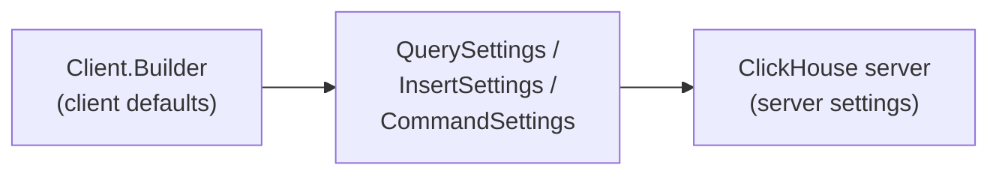

# ClickHouse Java Client Integration Guide

This guide walks through integrating ClickHouse using the **Java Client V2** (`client-v2`). It covers terminology, configuration, formats, read/write operations, and metadata discovery.

**Prerequisites:** Read [integration-common.md](integration-common.md) to confirm the Java Client is the right choice for your application.

| Resource | Link |
|----------|------|
| Official docs | [clickhouse.com/docs/integrations/java](https://clickhouse.com/docs/integrations/java) |
| Javadoc | [javadoc.io/doc/com.clickhouse/client-v2](https://javadoc.io/doc/com.clickhouse/client-v2) |
| Maven artifact | `com.clickhouse:client-v2` |
| Examples | [examples/client-v2](../examples/client-v2) |
| Authentication & TLS | [authentication.md](authentication.md) |
| Feature contract | [features.md](features.md) |

---

## Terminology and Internal Overview

Understanding a few core concepts before writing code will save time later.

### Client

The [`Client`](https://javadoc.io/doc/com.clickhouse/client-v2/latest/com/clickhouse/client/api/Client.html) is the entry point for all interactions. Create one instance (or a small pool of instances) and reuse it across threads — **`Client` is thread-safe**.

```java
Client client = new Client.Builder()
    .addEndpoint("http://localhost:8123")
    .setUsername("default")
    .setPassword("secret")
    .setDefaultDatabase("analytics")
    .build();
```

Internally, `Client` owns:

- An HTTP connection pool (Apache HttpClient)
- Endpoint configuration and retry policy
- A table schema cache
- POJO serialization/deserialization registry
- Optional client-wide session defaults

### Connection (HTTP, not JDBC)

In the Java Client, a "connection" is an **HTTP connection** from the internal pool, not a long-lived database session in the traditional sense. Each operation borrows an HTTP connection, sends a request, streams the response, and returns the connection to the pool.

Key related settings in [`ClientConfigProperties`](../client-v2/src/main/java/com/clickhouse/client/api/ClientConfigProperties.java):

| Property | Purpose |
|----------|---------|
| `max_open_connections` | Pool size (default: 10) |
| `connection_ttl` | Connection lifetime |
| `connection_reuse_strategy` | FIFO or LIFO reuse |
| `connection_timeout` | TCP connect timeout |
| `socket_timeout` | Socket read/write timeout |
| `connection_pool_enabled` | Enable/disable pooling |

### Session

A [`Session`](../client-v2/src/main/java/com/clickhouse/client/api/Session.java) represents ClickHouse HTTP session state (`session_id`, `session_check`, `session_timeout`, `session_timezone`). Sessions can be configured:

- **Client-wide** — via `Client.Builder.use(session)`; applies to all operations
- **Operation-wide** — via `QuerySettings.use(session)` or `InsertSettings.use(session)`; overrides client defaults for one request

HTTP sessions require **server affinity**. When using a load balancer, route session-bound requests to the same backend node or use sticky sessions. See [examples/client-v2 Sessions example](../examples/client-v2/src/main/java/com/clickhouse/examples/client_v2/Sessions.java).

### Operation types

| Operation | API | Returns |
|-----------|-----|---------|
| Query (SELECT) | `client.query(sql, settings)` | `CompletableFuture<QueryResponse>` |
| Insert | `client.insert(table, data, settings)` | `CompletableFuture<InsertResponse>` |
| Command (DDL, etc.) | `client.execute(sql, settings)` | `CompletableFuture<CommandResponse>` |

All operations are **asynchronous** (`CompletableFuture`). Convenience methods like `queryAll()` and `queryRecords()` block and materialize results.

---

## Configuration

Configuration happens at three levels. Operation settings override client defaults.



### Where to find properties

| Layer | Class | Description |
|-------|-------|-------------|
| Client defaults | [`ClientConfigProperties`](../client-v2/src/main/java/com/clickhouse/client/api/ClientConfigProperties.java) | All known client properties |
| Builder API | [`Client.Builder`](../client-v2/src/main/java/com/clickhouse/client/api/Client.java) | Fluent configuration at construction |
| Query operations | [`QuerySettings`](../client-v2/src/main/java/com/clickhouse/client/api/query/QuerySettings.java) | Per-query overrides |
| Insert operations | [`InsertSettings`](../client-v2/src/main/java/com/clickhouse/client/api/insert/InsertSettings.java) | Per-insert overrides |
| Command operations | [`CommandSettings`](../client-v2/src/main/java/com/clickhouse/client/api/command/CommandSettings.java) | Per-command overrides |

Properties can be set via builder methods, string key/value maps, or `setOption(key, value)` on operation settings.

### Server settings vs client settings

**Server settings** control ClickHouse query execution (e.g., `max_execution_time`, `max_threads`). Pass them with the `server_setting` prefix or via builder/operation helpers:

```java
// Client-wide
Client client = new Client.Builder()
    .addEndpoint("http://localhost:8123")
    .serverSetting("max_execution_time", "60")
    .build();

// Per-query
QuerySettings settings = new QuerySettings()
    .setMaxExecutionTime(60)
    .serverSetting("max_threads", "8");
```

**Client settings** control HTTP transport, pooling, compression, and timeouts. Examples: `compress`, `client.use_http_compression`, `retry`, `socket_timeout`.

Refer to [ClickHouse server settings documentation](https://clickhouse.com/docs/operations/settings/settings) for available server-side options.

### Non-standard communication (TLS, mTLS, proxies)

See [authentication.md](authentication.md) for full details. Summary:

| Scenario | Builder methods / properties |
|----------|------------------------------|
| HTTPS with public CA | `addEndpoint("https://host:8443")` |
| Self-signed server cert | `setRootCertificate("/path/to/ca.crt")` |
| mTLS (client certificate) | `useSSLAuthentication(true)`, `setClientCertificate(...)`, `setClientKey(...)` |
| Trust store (JKS/PKCS12) | `setSSLTrustStore(...)`, `setSSLTrustStorePassword(...)` |
| HTTP proxy | `setProxy(ProxyType.HTTP, host, port)`, `setProxyCredentials(user, password)` |
| Custom auth headers | `httpHeader("Authorization", "...")` |
| Bearer token | `useBearerTokenAuth("token")` |

**Example — self-signed certificate:**

```java
Client client = new Client.Builder()
    .addEndpoint("https://localhost:8443")
    .setUsername("default")
    .setPassword("secret")
    .setRootCertificate("/path/to/ca.crt")
    .build();
```

See [examples/client-v2 SSLExamples](../examples/client-v2/src/main/java/com/clickhouse/examples/client_v2/SSLExamples.java) for a runnable walkthrough.

### Read-oriented configuration

Tune these for analytical read workloads:

| Setting | Property / method | Notes |
|---------|-------------------|-------|
| Response compression | `compress=true` (default) | Server-side LZ4 compression |
| Output format | `QuerySettings.setFormat(...)` | Prefer binary formats for throughput |
| Read buffer | `QuerySettings.setReadBufferSize(n)` | Min 8192 bytes |
| Execution limit | `QuerySettings.setMaxExecutionTime(seconds)` | Server-side timeout |
| Max result rows | `serverSetting("max_result_rows", ...)` | Limit rows server-side |
| Async execution | `ClientConfigProperties.ASYNC_OPERATIONS` | Non-blocking client-side |
| Network timeout | `QuerySettings.setNetworkTimeout(...)` | Per-operation override |

### Write-oriented configuration

Tune these for bulk ingest:

| Setting | Property / method | Notes |
|---------|-------------------|-------|
| Client request compression | `InsertSettings.compressClientRequest(true)` | LZ4-compress insert body |
| HTTP compression | `InsertSettings.useHttpCompression(true)` | Content-Encoding header |
| Pre-compressed data | `InsertSettings.appCompressedData(true, "gzip")` | When you compress data yourself |
| Copy buffer size | `InsertSettings.setInputStreamCopyBufferSize(n)` | Stream-to-stream copy buffer |
| Async insert | `serverSetting("async_insert", "1")` | Server-side buffering |
| Deduplication | `InsertSettings.setDeduplicationToken(...)` | See [Write operations](#write-operations) |

### Special features

| Feature | How to use |
|---------|------------|
| Named parameters | `client.query("SELECT * FROM t WHERE id = {id:UInt64}", Map.of("id", 42), settings)` |
| DB roles | `client.setDBRoles(List.of("analyst"))` or per-operation `settings.setDBRoles(...)` |
| Query ID | `settings.setQueryId("my-query-id")` — appears in `system.query_log` |
| Log comment | `settings.logComment("batch-job-42")` — appears in query log |
| Retry on failure | `retry=3` (default), configurable fault causes via `client_retry_on_failures` |
| Runtime credential update | `client.updateUserAndPassword(...)`, `client.updateBearerToken(...)` |
| Metrics | Micrometer integration via `metrics_name` property |
| Custom settings prefix | `custom_settings_prefix` for prefixed server settings |

---

## Supported Formats Overview

ClickHouse supports many [input/output formats](https://clickhouse.com/docs/interfaces/formats). The Java Client lets you choose the format per operation.

All formats are defined in [`ClickHouseFormat`](../clickhouse-data/src/main/java/com/clickhouse/data/ClickHouseFormat.java). Each format declares whether it supports input, output, binary encoding, headers, and row-based layout.

### Format categories

| Category | Examples | Typical use |
|----------|----------|-------------|
| Binary (high throughput) | `RowBinary`, `RowBinaryWithNamesAndTypes`, `Native` | Production ingest and ETL |
| Text (human-readable) | `TabSeparated`, `CSV`, `JSONEachRow` | Debugging, ad-hoc export, interoperability |
| Columnar file | `Parquet`, `Arrow`, `ORC`, `Avro` | Data lake integration |
| Schema-aware binary | `RowBinaryWithNamesAndTypes` | Self-describing streams without prior schema |

### What the client can read

Use `QuerySettings.setFormat(format)` and consume the response stream:

| Reader class | Formats |
|--------------|---------|
| [`NativeFormatReader`](../client-v2/src/main/java/com/clickhouse/client/api/data_formats/NativeFormatReader.java) | `Native` |
| [`RowBinaryFormatReader`](../client-v2/src/main/java/com/clickhouse/client/api/data_formats/RowBinaryFormatReader.java) | `RowBinary` variants |
| [`ClickHouseBinaryFormatReader`](../client-v2/src/main/java/com/clickhouse/client/api/data_formats/ClickHouseBinaryFormatReader.java) | General binary access |
| Text / JSON | Read `QueryResponse.getInputStream()` directly |

Convenience methods:

- `client.queryAll(sql)` — materialize all rows as `GenericRecord`
- `client.queryRecords(sql, settings)` — lazy `Records` iterator
- `client.queryAll(sql, MyPojo.class)` — materialize as typed POJOs (requires registration)

### What the client can write

Use `client.insert(...)` with a format:

| Method | Description |
|--------|-------------|
| `insert(table, List<?> pojos)` | Registered POJO serialization |
| `insert(table, InputStream, format)` | Stream pre-serialized data |
| `insert(table, columns, InputStream, format)` | Partial-column stream insert |
| `insert(table, writer, format, settings)` | Callback-driven `DataStreamWriter` |

Writers: [`RowBinaryFormatWriter`](../client-v2/src/main/java/com/clickhouse/client/api/data_formats/RowBinaryFormatWriter.java), [`ClickHouseBinaryFormatWriter`](../client-v2/src/main/java/com/clickhouse/client/api/data_formats/ClickHouseBinaryFormatWriter.java).

### Limitations

- Not every `ClickHouseFormat` enum value has a dedicated reader/writer in the client. Text and binary row formats are fully supported; some specialized formats (e.g., `CapnProto`, `MySQLDump`) may require raw stream handling.
- `Native` format is block-oriented — best for high-throughput scenarios where you control both schema and consumption.
- Format choice must match what the ClickHouse table/query supports. Mismatched types produce server-side errors.
- POJO SerDe covers common and many advanced types but has known limitations for `Geometry` shape inference (see [features.md](features.md)).

### How to choose a format

| Goal | Recommended format |
|------|--------------------|
| Maximum read throughput | `Native` or `RowBinaryWithNamesAndTypes` |
| Maximum write throughput | `RowBinary` or `Native` |
| Interop with other systems | `JSONEachRow`, `CSV`, `Parquet` |
| Debugging / inspection | `TabSeparated`, `JSONEachRow` |
| Schema-less exploration | `RowBinaryWithNamesAndTypes` (includes column names and types in stream) |
| POJO-based ingest | Register POJO + use default RowBinary writer |

---

## Read Operations

### General interface overview

```java
// Async query with streaming response
QuerySettings settings = new QuerySettings()
    .setFormat(ClickHouseFormat.RowBinaryWithNamesAndTypes);

try (QueryResponse response = client.query("SELECT * FROM events", settings)
        .get(30, TimeUnit.SECONDS)) {

    ClickHouseBinaryFormatReader reader = client.newBinaryFormatReader(response);
    while (reader.hasNext()) {
        reader.next();
        long id = reader.getLong("id");
        String name = reader.getString("name");
    }
}

// Convenience: materialize all rows
List<GenericRecord> rows = client.queryAll("SELECT count() FROM events");
```

**Key classes:**

| Class | Role |
|-------|------|
| [`QueryResponse`](../client-v2/src/main/java/com/clickhouse/client/api/query/QueryResponse.html) | Streaming HTTP response; must be closed |
| [`QuerySettings`](../client-v2/src/main/java/com/clickhouse/client/api/query/QuerySettings.java) | Per-query configuration |
| [`Records`](../client-v2/src/main/java/com/clickhouse/client/api/query/Records.java) | Lazy record iterator |
| [`GenericRecord`](../client-v2/src/main/java/com/clickhouse/client/api/query/GenericRecord.java) | Column access by name or index |
| [`QueryResponse.getMetrics()`](../client-v2/src/main/java/com/clickhouse/client/api/metrics/OperationMetrics.java) | Server timing and row counts |

Parameterized queries:

```java
Map<String, Object> params = Map.of("min_id", 1000);
client.query("SELECT * FROM events WHERE id > {min_id:UInt64}", params, settings);
```

Placeholders use ClickHouse syntax: `{name:Type}`. The value must match the expected textual representation for that type.

### Limitations

- Large result sets: `queryAll()` loads everything into memory. Use streaming readers or `queryRecords()` for big results.
- Format support varies by reader class — verify your chosen format has a reader before production use.
- Named parameter typing is strict — mismatched types cause server errors.
- Session-bound queries require server affinity behind load balancers.

### Read best practices

- **Prefer binary formats** (`RowBinaryWithNamesAndTypes`, `Native`) over text formats for production workloads.
- **Stream, don't materialize** — use `QueryResponse` + binary reader for large datasets.
- **Set server-side limits** — use `max_execution_time` and `max_result_rows` to prevent runaway queries.
- **Reuse the Client** — create once, share across threads; do not create a new client per query.
- **Register POJOs once** — `client.register(MyRecord.class, schema)` at startup, not per query.
- **Close responses** — always use try-with-resources on `QueryResponse`.
- **Use query IDs and log comments** — essential for correlating application logs with `system.query_log`.

### Read don'ts

- **Don't** call `queryAll()` on unbounded `SELECT *` against large tables.
- **Don't** use `JSON` or `Pretty` formats in high-throughput pipelines.
- **Don't** create a new `Client` per request — connection pool warmup adds latency.
- **Don't** ignore `QueryResponse` close — leaked responses hold HTTP connections.
- **Don't** assume text format parsing is as fast as binary — measure before choosing.

---

## Write Operations

### General interface overview

The client supports three insert patterns:

**1. POJO list insert** (simplest for typed data):

```java
client.register(Event.class, client.getTableSchema("events"));
client.insert("events", List.of(new Event(...), new Event(...))).get();
```

**2. Stream insert** (best for bulk/pre-serialized data):

```java
InsertSettings settings = new InsertSettings()
    .compressClientRequest(true);

try (InputStream data = openJsonLinesStream()) {
    client.insert("events", data, ClickHouseFormat.JSONEachRow, settings).get();
}
```

**3. Callback writer** (best for generated binary data):

```java
client.insert("events", outputStream -> {
    RowBinaryFormatWriter writer = new RowBinaryFormatWriter(outputStream, schema);
    for (Event event : events) {
        writer.writeObject(event);
    }
    writer.flush();
}, ClickHouseFormat.RowBinary);
```

**Key classes:**

| Class | Role |
|-------|------|
| [`InsertResponse`](../client-v2/src/main/java/com/clickhouse/client/api/insert/InsertResponse.java) | Insert operation result; must be closed |
| [`InsertSettings`](../client-v2/src/main/java/com/clickhouse/client/api/insert/InsertSettings.java) | Per-insert configuration |
| [`DataStreamWriter`](../client-v2/src/main/java/com/clickhouse/client/api/DataStreamWriter.java) | Callback interface for writer-based inserts |

### Deduplication token

When inserting into a `MergeTree`-family table with deduplication enabled, ClickHouse can skip duplicate blocks. The **`insert_deduplication_token`** server setting identifies an insert attempt so retries do not create duplicate rows.

```java
InsertSettings settings = new InsertSettings()
    .setDeduplicationToken("batch-2024-06-18-part-001");

client.insert("events", dataStream, ClickHouseFormat.JSONEachRow, settings).get();
```

**How it works:**

1. You assign a unique token per logical batch (e.g., derived from file name, Kafka offset, or job ID).
2. The server records the token alongside the inserted block.
3. If the same token is sent again within the deduplication window, the server skips the duplicate insert.

**When to use it:**

- Retry-safe ingest pipelines (network failures, client retries)
- At-least-once delivery sources (Kafka, SQS, file reprocessing)
- Idempotent batch jobs

**Requirements:**

- Table must use a `MergeTree` engine with deduplication configured (e.g., `non_replicated_deduplication_window` for non-replicated tables, or ReplicatedMergeTree with standard deduplication).
- Token must be stable for a given logical batch across retries.
- Use a different token for each distinct batch.

See the integration test in [`InsertTests.testInsertSettingsDeduplicationToken`](../client-v2/src/test/java/com/clickhouse/client/insert/InsertTests.java) for a working example.

### Write best practices

- **Batch inserts** — send rows in large chunks (thousands to millions), not one row per request.
- **Use binary formats** for production ingest (`RowBinary`, `Native`, or registered POJOs).
- **Enable compression** — `compressClientRequest(true)` reduces network payload for large inserts.
- **Set deduplication tokens** on retry-prone pipelines.
- **Use `async_insert`** server setting when you need fire-and-forget buffering (server-side).
- **Pre-fetch table schema** — `client.getTableSchema("table")` once and reuse; schema is cached internally.
- **Match column types** — verify schema before writing; type mismatches fail at the server.

### Write don'ts

- **Don't** insert one row per HTTP request — overhead dominates at scale.
- **Don't** retry without a deduplication token on MergeTree tables — duplicates may appear.
- **Don't** mix formats in a single insert stream.
- **Don't** send text formats without verifying escaping and column order.
- **Don't** ignore `InsertResponse` close — release HTTP connections promptly.
- **Don't** assume POJO SerDe handles every ClickHouse type — test with your schema first.

---

## Getting Metadata and Table Schemas

The client provides schema discovery without going through JDBC `DatabaseMetaData`.

### Table schema from table name

```java
TableSchema schema = client.getTableSchema("events");
TableSchema schema = client.getTableSchema("events", "analytics"); // explicit database

for (ClickHouseColumn column : schema.getColumns()) {
    System.out.println(column.getColumnName() + " : " + column.getDataType());
}
```

Internally this runs `DESCRIBE TABLE` and parses the result via [`TableSchemaParser`](../client-v2/src/main/java/com/clickhouse/client/api/internal/TableSchemaParser.java).

### Schema from a query

When you need the schema of a query result (not an existing table):

```java
TableSchema schema = client.getTableSchemaFromQuery(
    "SELECT id, name, created_at FROM events WHERE id > 0"
);
```

### POJO registration

For typed read/write, register a POJO against a schema:

```java
TableSchema schema = client.getTableSchema("events");
client.register(Event.class, schema);

// Now you can:
List<Event> events = client.queryAll("SELECT * FROM events", Event.class);
client.insert("events", events);
```

Matching between POJO fields and columns is controlled by [`ColumnToMethodMatchingStrategy`](../client-v2/src/main/java/com/clickhouse/client/api/metadata/ColumnToMethodMatchingStrategy.java) (default: camelCase field to snake_case column).

### Manual schema registration

If you already know the schema, register it directly:

```java
client.registerTableSchema("events", schema);
```

### Tools summary

| Tool | Method | Use case |
|------|--------|----------|
| Table schema | `getTableSchema(table)` | Inserts, POJO binding, writers |
| Query schema | `getTableSchemaFromQuery(sql)` | Dynamic queries, unknown result shape |
| POJO registry | `register(Class, schema)` | Typed query/insert |
| Schema cache | Automatic | Avoid repeated DESCRIBE calls |
| Column metadata | `TableSchema.getColumnByName(name)` | Type-aware read/write |
| Server info | `client.loadServerInfo()` | Version, timezone, current user |

For JDBC-style catalog metadata (`DatabaseMetaData`), use the [JDBC integration guide](integration-jdbc.md) instead.

---

## Quick Reference

```java
// Build client
Client client = new Client.Builder()
    .addEndpoint("http://localhost:8123")
    .setUsername("default")
    .setPassword("secret")
    .setDefaultDatabase("default")
    .serverSetting("max_execution_time", "120")
    .build();

// Health check
if (!client.ping()) { throw new RuntimeException("ClickHouse unreachable"); }

// Read
List<GenericRecord> rows = client.queryAll("SELECT 1");

// Write
client.insert("my_table", jsonInputStream, ClickHouseFormat.JSONEachRow).get();

// Schema
TableSchema schema = client.getTableSchema("my_table");

// Cleanup
client.close();
```

**Related documents:**

- [integration-common.md](integration-common.md) — choosing JDBC vs Client
- [integration-jdbc.md](integration-jdbc.md) — JDBC integration path
- [authentication.md](authentication.md) — authentication and TLS
- [features.md](features.md) — compatibility contract
