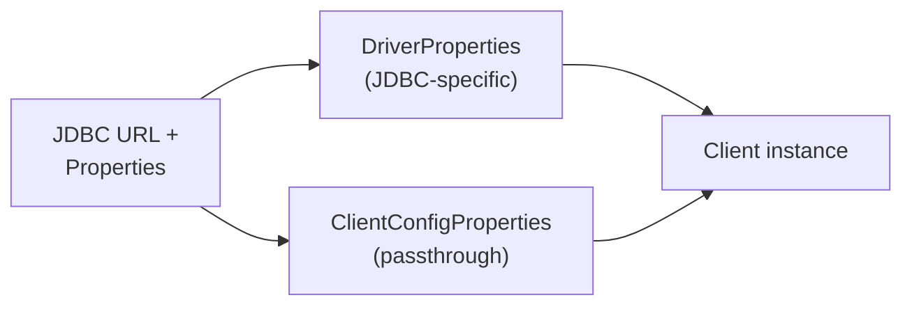

# ClickHouse JDBC Integration Guide

This guide walks through integrating ClickHouse using the **JDBC Driver V2** (`jdbc-v2`, artifact `com.clickhouse:clickhouse-jdbc`). It covers terminology, configuration, formats, read/write operations, and metadata discovery.

**Prerequisites:** Read [integration-common.md](integration-common.md) to understand JDBC trade-offs before committing to this path.

| Resource | Link |
|----------|------|
| Official docs | [clickhouse.com/docs/integrations/language-clients/java/jdbc](https://clickhouse.com/docs/integrations/language-clients/java/jdbc) |
| Javadoc | [javadoc.io/doc/com.clickhouse/clickhouse-jdbc](https://javadoc.io/doc/com.clickhouse/clickhouse-jdbc) |
| Maven artifact | `com.clickhouse:clickhouse-jdbc` (use `all` classifier for bundled dependencies) |
| Examples | [examples/jdbc](../examples/jdbc) |
| Authentication & TLS | [authentication.md](authentication.md) |
| Feature contract | [features.md](features.md) |

---

## Terminology and Internal Overview

### Connection

A JDBC [`Connection`](../jdbc-v2/src/main/java/com/clickhouse/jdbc/ConnectionImpl.java) (`ConnectionImpl`) represents one application-level link to ClickHouse. Internally, each connection wraps a [`Client`](../client-v2/src/main/java/com/clickhouse/client/api/Client.java) instance from `client-v2`.

```
Application  →  ConnectionImpl  →  Client  →  HTTP pool  →  ClickHouse
```

Key points:

- `Connection` is **not** a long-lived TCP session in the traditional database sense — it manages configuration and delegates to the HTTP client.
- `Connection` is **not thread-safe**. Use one connection per thread, or pool connections externally.
- `Connection.close()` closes the underlying `Client` and its HTTP pool.
- `Connection.isValid(timeout)` performs a ping health check.

### Statement and PreparedStatement

| Object | Class | Role |
|--------|-------|------|
| `Statement` | [`StatementImpl`](../jdbc-v2/src/main/java/com/clickhouse/jdbc/StatementImpl.java) | Execute raw SQL strings |
| `PreparedStatement` | [`PreparedStatementImpl`](../jdbc-v2/src/main/java/com/clickhouse/jdbc/PreparedStatementImpl.java) | Parameterized SQL with `?` placeholders |
| Writer statement | [`WriterStatementImpl`](../jdbc-v2/src/main/java/com/clickhouse/jdbc/WriterStatementImpl.java) | Streaming RowBinary insert via prepared statement |

**Important:** JDBC prepared statements are **client-side SQL rendering**. The driver substitutes `?` placeholders with escaped literals before sending SQL to ClickHouse. There are no server-side prepared statements.

### ResultSet

[`ResultSetImpl`](../jdbc-v2/src/main/java/com/clickhouse/jdbc/ResultSetImpl.java) streams query results row-by-row from ClickHouse binary formats. This is the row-oriented contract that limits throughput compared to the native Java Client — see [integration-common.md](integration-common.md).

### Driver

[`Driver`](../jdbc-v2/src/main/java/com/clickhouse/jdbc/Driver.java) registers via the standard JDBC service mechanism. It accepts URLs with the prefixes `jdbc:clickhouse:` and `jdbc:ch:`.

---

## Configuration

Configuration happens at two layers: **JDBC driver properties** (handled by the driver) and **client properties** (passed through to the underlying `Client`).



Processing logic (from [`DriverProperties`](../jdbc-v2/src/main/java/com/clickhouse/jdbc/DriverProperties.java)):

1. If a property is in `DriverProperties`, the driver handles it and does **not** pass it to the client.
2. All other properties are forwarded to `ClientConfigProperties`.

### JDBC URL format

```
jdbc:clickhouse://[host][:port][/[path/]database][?param=value&...]
jdbc:clickhouse:https://host:8443/mydb?ssl=true
jdbc:ch://localhost:8123/default
```

Examples:

```java
// Basic
String url = "jdbc:clickhouse://localhost:8123/default";

// HTTPS with database and settings
String url = "jdbc:clickhouse://clickhouse.example.com:8443/analytics"
    + "?ssl=true"
    + "&compress=1"
    + "&max_execution_time=120";

// With credentials in Properties (preferred over URL embedding)
Properties props = new Properties();
props.setProperty("user", "default");
props.setProperty("password", "secret");

Connection conn = DriverManager.getConnection(url, props);
```

URL parameters map to client or driver properties. See [`JdbcConfiguration`](../jdbc-v2/src/main/java/com/clickhouse/jdbc/internal/JdbcConfiguration.java) for parsing details.

### Where to find properties

| Layer | Class | Description |
|-------|-------|-------------|
| JDBC-specific | [`DriverProperties`](../jdbc-v2/src/main/java/com/clickhouse/jdbc/DriverProperties.java) | Driver-only settings |
| Client passthrough | [`ClientConfigProperties`](../client-v2/src/main/java/com/clickhouse/client/api/ClientConfigProperties.java) | Forwarded to underlying client |
| URL + Properties | [`JdbcConfiguration`](../jdbc-v2/src/main/java/com/clickhouse/jdbc/internal/JdbcConfiguration.java) | Parses and merges both layers |
| DataSource | [`DataSourceImpl`](../jdbc-v2/src/main/java/com/clickhouse/jdbc/DataSourceImpl.java) | Programmatic configuration |

Key JDBC-specific properties:

| Property | Default | Purpose |
|----------|---------|---------|
| `ssl` | `false` | Enable HTTPS |
| `jdbc_ignore_unsupported_values` | `false` | Silently ignore unsupported JDBC calls |
| `jdbc_resultset_auto_close` | `true` | Auto-close result set on new query |
| `jdbc_use_max_result_rows` | `false` | Use server `max_result_rows` setting |
| `beta.row_binary_for_simple_insert` | `false` | RowBinary writer for simple INSERT |
| `jdbc_sql_parser` | `JAVACC` | SQL parser backend |
| `jdbc_cluster_name` | — | Cluster name for `KILL QUERY ON CLUSTER` |
| `jdbc_type_mappings` | — | Custom ClickHouse → Java type overrides |
| `default_query_settings` | — | Default settings for all queries |

All [`ClientConfigProperties`](../client-v2/src/main/java/com/clickhouse/client/api/ClientConfigProperties.java) (e.g., `max_open_connections`, `compress`, `retry`, server settings) can be set via URL parameters or `Properties`.

### Server settings vs client settings

Server settings control ClickHouse execution; client settings control HTTP transport. Both can be set via URL/Properties:

```java
Properties props = new Properties();
props.setProperty("user", "default");
props.setProperty("password", "secret");
// Server setting (note the prefix)
props.setProperty("max_execution_time", "60");
// Client setting
props.setProperty("max_open_connections", "20");

Connection conn = DriverManager.getConnection(
    "jdbc:clickhouse://localhost:8123/default", props);
```

Per-statement server settings can be applied via `Statement.setQueryTimeout()` or by embedding settings in SQL (`SETTINGS` clause).

Refer to [ClickHouse server settings](https://clickhouse.com/docs/operations/settings/settings) for available options.

### Non-standard communication (TLS, mTLS, proxies)

The JDBC driver delegates TLS and proxy configuration to the underlying client. Set these via URL parameters or `Properties`:

| Scenario | Property / URL parameter |
|----------|--------------------------|
| Enable HTTPS | `ssl=true` + port 8443 |
| Self-signed server cert | `sslrootcert=/path/to/ca.crt` |
| Client certificate (mTLS) | `sslcert`, `ssl_key`, `ssl_authentication=true` |
| Trust store | `trust_store`, `key_store_password`, `key_store_type` |
| HTTP proxy | `proxy_type=http`, `proxy_host`, `proxy_port`, `proxy_user`, `proxy_password` |
| Bearer token | `access_token` or `bearer_token` |

**Example — self-signed certificate:**

```java
Properties props = new Properties();
props.setProperty("user", "default");
props.setProperty("password", "secret");
props.setProperty("ssl", "true");
props.setProperty("sslrootcert", "/path/to/ca.crt");

Connection conn = DriverManager.getConnection(
    "jdbc:clickhouse://localhost:8443/default", props);
```

See [examples/jdbc SSLExamples](../examples/jdbc/src/main/java/com/clickhouse/examples/jdbc/SSLExamples.java) and [authentication.md](authentication.md) for full details.

### Read-oriented configuration

| Setting | Property | Notes |
|---------|----------|-------|
| Response compression | `compress=true` (default) | Server-side LZ4 |
| Max execution time | `max_execution_time` | Server-side query timeout |
| Max result rows | `jdbc_use_max_result_rows=true` | Server-side row limit |
| Query timeout | `Statement.setQueryTimeout(seconds)` | JDBC-level timeout |
| Result set auto-close | `jdbc_resultset_auto_close=true` | Close previous result on new query |
| Fetch size | `Statement.setFetchSize(n)` | Hint for streaming batch size |
| Read-only | `Connection.setReadOnly(true)` | Metadata hint (ClickHouse has no true read-only mode) |

**Tip:** Set row limits in SQL (`LIMIT n`) rather than relying on client-side truncation. When `jdbc_use_max_result_rows` is disabled, the driver stops reading at the limit but the server may still send remaining data.

### Write-oriented configuration

| Setting | Property | Notes |
|---------|----------|-------|
| Batch inserts | `PreparedStatement.addBatch()` / `executeBatch()` | Multi-row rewrite for eligible INSERTs |
| RowBinary writer | `beta.row_binary_for_simple_insert=true` | Binary format for simple `INSERT INTO t VALUES (?, ?, ?)` |
| Client compression | `decompress=true` | LZ4-compress insert payload |
| HTTP compression | `client.use_http_compression=true` | Content-Encoding on HTTP layer |
| Async insert | `async_insert=1` (server setting) | Server-side insert buffering |

### JDBC-specific features

| Feature | How to use |
|---------|------------|
| Application name | `Connection.setClientInfo("ApplicationName", "my-app")` |
| Schema / database | `Connection.setSchema("analytics")` or URL path |
| Query cancellation | `Statement.cancel()` → `KILL QUERY` (with optional `jdbc_cluster_name`) |
| JDBC escape syntax | `{ts '...'}`, `{d '...'}`, `{fn ...}` — translated before execution |
| Custom type mappings | `jdbc_type_mappings=UInt64=java.math.BigInteger` |
| Default query settings | `default_query_settings` property |
| Role management | `SET ROLE` statements (roles remembered by default) |
| Framework detection | Automatic — logged at connection time (Spark, Flink, NiFi) |

---

## Supported Formats Overview

JDBC does not expose format selection directly. The driver chooses formats internally based on the operation type.

### What happens under the hood

| Operation | Internal format | Notes |
|-----------|----------------|-------|
| Query (`executeQuery`) | Binary row format from server | Converted to JDBC `ResultSet` rows |
| Simple INSERT via Statement | SQL text | `INSERT INTO t VALUES (...)` sent as SQL |
| PreparedStatement INSERT | SQL text or RowBinary | RowBinary when `beta.row_binary_for_simple_insert=true` |
| WriterStatement INSERT | RowBinary | Streaming binary writer |
| Batch INSERT | Multi-row SQL rewrite or RowBinary | Depends on statement shape |

### Limitations (JDBC-specific)

- **No format selection API** — you cannot request `Native`, `Parquet`, or `JSONEachRow` through standard JDBC interfaces.
- **Row-oriented output** — all query results arrive as `ResultSet` rows regardless of the wire format used internally.
- **No parallel block processing** — the JDBC contract prevents column-oriented or parallel consumption.
- **Type mapping layer** — ClickHouse types are converted to JDBC types, which may lose precision or structure for complex types.
- **Text INSERT overhead** — default SQL-based inserts are slower than streaming binary formats available in the Java Client.

### How to choose an approach

| Goal | JDBC approach | Better alternative |
|------|---------------|-------------------|
| Simple CRUD / reporting | Standard JDBC — sufficient | — |
| Bulk ingest (millions of rows) | Batch `PreparedStatement` + RowBinary beta | Java Client stream insert |
| Complex type handling | `getObject()` with type map | Java Client POJO/binary readers |
| Export to file format | Not supported via JDBC | Java Client with format selection |
| BI tool integration | JDBC is the right choice | — |

For format-level control, use the [Java Client integration guide](integration-client.md).

---

## Read Operations

### General interface overview

Standard JDBC read flow:

```java
String url = "jdbc:clickhouse://localhost:8123/default";
Properties props = new Properties();
props.setProperty("user", "default");

try (Connection conn = DriverManager.getConnection(url, props);
     Statement stmt = conn.createStatement();
     ResultSet rs = stmt.executeQuery("SELECT id, name, created_at FROM events LIMIT 1000")) {

    while (rs.next()) {
        long id = rs.getLong("id");
        String name = rs.getString("name");
        Timestamp created = rs.getTimestamp("created_at");
    }
}
```

**Key classes:**

| Class | Role |
|-------|------|
| [`StatementImpl`](../jdbc-v2/src/main/java/com/clickhouse/jdbc/StatementImpl.java) | Execute queries, manage timeouts and cancellation |
| [`ResultSetImpl`](../jdbc-v2/src/main/java/com/clickhouse/jdbc/ResultSetImpl.java) | Row-by-row result streaming |
| [`ResultSetMetaData`](../jdbc-v2/src/main/java/com/clickhouse/jdbc/metadata/) | Column names, types, and precision |
| [`PreparedStatementImpl`](../jdbc-v2/src/main/java/com/clickhouse/jdbc/PreparedStatementImpl.java) | Parameterized queries |

Type-specific accessors:

```java
// Standard JDBC types
rs.getString("uuid_col");
rs.getLong("int_col");
rs.getBigDecimal("decimal_col");

// java.time support
rs.getObject("ts_col", LocalDateTime.class);

// Custom type mapping
Map<String, Class<?>> typeMap = Map.of("UInt64", BigInteger.class);
rs.getObject("big_num", typeMap);

// ClickHouse arrays and tuples
Array array = rs.getArray("tags");
Struct tuple = (Struct) rs.getObject("point");
```

### Limitations

- **Row-by-row only** — no batch column access or parallel processing.
- **Memory** — iterating `ResultSet` is streaming, but some frameworks materialize all rows.
- **Complex types** — `Array`, `Tuple`, `Map`, `Nested`, `Variant`, `Dynamic`, and geometry types require `getObject()` / `getArray()` / `getStruct()` rather than primitive getters.
- **No server-side cursors** — ClickHouse sends the full result set; the driver streams it.
- **Large integers** — `UInt64` and wider types may require `BigInteger` or custom type mapping.
- **Scrollable/updatable result sets** — not supported (forward-only, read-only).

### Read best practices

- **Always use `LIMIT`** in SQL for exploratory queries.
- **Set query timeout** — `Statement.setQueryTimeout(seconds)` prevents hung queries.
- **Use try-with-resources** — close `Connection`, `Statement`, and `ResultSet` promptly.
- **Prefer PreparedStatement** for repeated queries — avoids SQL injection and enables parameter binding.
- **Configure type mappings** for large integers: `jdbc_type_mappings=UInt64=java.math.BigInteger`.
- **Use `getObject(column, Class)`** for `java.time` types instead of legacy `getTimestamp()`.
- **Set `ApplicationName`** via client info for query log correlation.

### Read don'ts

- **Don't** run unbounded `SELECT *` on large tables without `LIMIT`.
- **Don't** share a `Connection` across threads — it is not thread-safe.
- **Don't** assume `getInt()` works for `UInt64` or `Int128` — use `getBigInteger()` or custom mapping.
- **Don't** rely on scrollable result sets — they are not supported.
- **Don't** expect JDBC metadata methods to reflect ClickHouse-specific type nuances — check `getColumnTypeName()` for the native type string.
- **Don't** use JDBC for high-throughput analytical reads when you control the application code — use the Java Client instead.

---

## Write Operations

### General interface overview

**Simple INSERT via Statement:**

```java
Statement stmt = conn.createStatement();
stmt.executeUpdate("INSERT INTO events (id, name) VALUES (1, 'click'), (2, 'house')");
```

**Parameterized INSERT via PreparedStatement:**

```java
PreparedStatement ps = conn.prepareStatement(
    "INSERT INTO events (id, name, created_at) VALUES (?, ?, ?)");

for (Event event : events) {
    ps.setLong(1, event.getId());
    ps.setString(2, event.getName());
    ps.setObject(3, event.getCreatedAt());
    ps.addBatch();
}
ps.executeBatch();
```

**RowBinary streaming insert (beta):**

Enable `beta.row_binary_for_simple_insert=true` for simple `INSERT INTO t VALUES (?, ?, ?)` statements. The driver uses [`WriterStatementImpl`](../jdbc-v2/src/main/java/com/clickhouse/jdbc/WriterStatementImpl.java) internally to serialize rows as RowBinary instead of SQL text.

```java
Properties props = new Properties();
props.setProperty("beta.row_binary_for_simple_insert", "true");
// ... connect and use PreparedStatement as above
```

**Key classes:**

| Class | Role |
|-------|------|
| [`PreparedStatementImpl`](../jdbc-v2/src/main/java/com/clickhouse/jdbc/PreparedStatementImpl.java) | Parameter binding and batch execution |
| [`WriterStatementImpl`](../jdbc-v2/src/main/java/com/clickhouse/jdbc/WriterStatementImpl.java) | RowBinary streaming writer |
| [`InsertSettings`](../client-v2/src/main/java/com/clickhouse/client/api/insert/InsertSettings.java) | Used internally for insert configuration |

### Deduplication token

JDBC does not expose `insert_deduplication_token` as a first-class API. To use deduplication with JDBC:

**Option 1 — Server setting via connection property:**

```java
Properties props = new Properties();
props.setProperty("insert_deduplication_token", "batch-2024-06-18-part-001");
Connection conn = DriverManager.getConnection(url, props);
// All inserts on this connection use the same token
```

**Option 2 — SETTINGS clause in SQL:**

```java
stmt.executeUpdate(
    "INSERT INTO events SETTINGS insert_deduplication_token = 'batch-001' VALUES (1, 'a')");
```

**Option 3 — Switch to the Java Client** for per-insert token control via `InsertSettings.setDeduplicationToken(...)`.

See [integration-client.md — Deduplication token](integration-client.md#deduplication-token) for semantics and requirements.

### Write best practices

- **Batch inserts** — use `addBatch()` / `executeBatch()` with hundreds to thousands of rows per batch.
- **Enable RowBinary beta** for simple inserts — significantly faster than SQL text rendering.
- **Match column types** — bind values with the correct `setXxx()` method for each ClickHouse column type.
- **Use PreparedStatement** for repeated inserts — the driver renders and escapes values correctly.
- **Set deduplication tokens** on retry-prone pipelines (via property or SQL SETTINGS).
- **Disable auto-commit concerns** — ClickHouse does not support transactions; each statement executes immediately.
- **Large batches** — tune batch size based on row width; monitor server `system.query_log` for insert performance.

### Write don'ts

- **Don't** insert one row per `executeUpdate()` call — HTTP overhead dominates.
- **Don't** build INSERT SQL strings manually — use PreparedStatement to avoid escaping bugs.
- **Don't** expect transactional rollback — ClickHouse auto-commits; failed batches may leave partial data (depending on engine).
- **Don't** use JDBC batching for complex INSERT shapes (e.g., `INSERT SELECT`, multi-table) — these require Statement.
- **Don't** rely on JDBC for maximum ingest throughput — the Java Client stream insert API is significantly faster.
- **Don't** retry failed inserts without a deduplication token on MergeTree tables.

---

## Getting Metadata and Table Schemas

JDBC provides standard metadata interfaces backed by ClickHouse system tables.

### DatabaseMetaData

```java
DatabaseMetaData meta = conn.getMetaData();

// List tables
try (ResultSet tables = meta.getTables(null, "default", "%", new String[]{"TABLE"})) {
    while (tables.next()) {
        System.out.println(tables.getString("TABLE_NAME"));
    }
}

// List columns
try (ResultSet columns = meta.getColumns(null, "default", "events", "%")) {
    while (columns.next()) {
        String name = columns.getString("COLUMN_NAME");
        int jdbcType = columns.getInt("DATA_TYPE");
        String chType = columns.getString("TYPE_NAME");
        System.out.println(name + " : JDBC=" + jdbcType + " CH=" + chType);
    }
}
```

Implemented by [`DatabaseMetaDataImpl`](../jdbc-v2/src/main/java/com/clickhouse/jdbc/metadata/DatabaseMetaDataImpl.java). Supports:

- Catalogs, schemas, tables, views, and materialized views
- Column metadata with both JDBC type codes and native ClickHouse type names
- Primary keys, index info (ClickHouse sorting keys)
- Table types mapped from ClickHouse engines

### ResultSetMetaData

For query result columns:

```java
ResultSetMetaData rsMeta = rs.getMetaData();
int columnCount = rsMeta.getColumnCount();
for (int i = 1; i <= columnCount; i++) {
    System.out.println(rsMeta.getColumnName(i) + " : "
        + rsMeta.getColumnTypeName(i));  // native ClickHouse type
}
```

Use `getColumnTypeName()` for the exact ClickHouse type string (e.g., `Nullable(UInt64)`), and `getColumnType()` for the mapped JDBC type code.

### ParameterMetaData

PreparedStatement parameter count:

```java
ParameterMetaData paramMeta = ps.getParameterMetaData();
int paramCount = paramMeta.getParameterCount();
```

### Type mapping reference

The driver maps ClickHouse types to JDBC types. For complex mappings (e.g., `UInt64` → `NUMERIC`, `Tuple` → `STRUCT`), see [type_mapping.md](../type_mapping.md) in the repository root.

Custom overrides:

```java
Properties props = new Properties();
props.setProperty("jdbc_type_mappings", "UInt64=java.math.BigInteger,Int128=java.math.BigInteger");
```

Or per-connection:

```java
((ConnectionImpl) conn).setTypeMap(Map.of("UInt64", BigInteger.class));
```

### Tools summary

| Tool | Interface | Use case |
|------|-----------|----------|
| Table discovery | `DatabaseMetaData.getTables()` | List tables and views |
| Column discovery | `DatabaseMetaData.getColumns()` | Schema inspection, ORM tooling |
| Query result schema | `ResultSetMetaData` | Dynamic query handling |
| Parameter count | `ParameterMetaData` | Validate prepared statements |
| Native type name | `getColumnTypeName()` | Exact ClickHouse type |
| JDBC type code | `getColumnType()` | Standard JDBC interop |
| Custom type map | `jdbc_type_mappings` / `setTypeMap()` | Override default mappings |
| Client-side schema | `ConnectionImpl.getClient().getTableSchema()` | Advanced: access underlying client API |

For schema-driven POJO binding and binary format writers, consider the [Java Client integration guide](integration-client.md).

---

## Quick Reference

```java
// Connect
Properties props = new Properties();
props.setProperty("user", "default");
props.setProperty("password", "secret");

try (Connection conn = DriverManager.getConnection(
        "jdbc:clickhouse://localhost:8123/default", props)) {

    // Health check
    if (!conn.isValid(5)) { throw new RuntimeException("ClickHouse unreachable"); }

    // Read
    try (Statement stmt = conn.createStatement();
         ResultSet rs = stmt.executeQuery("SELECT 1")) {
        rs.next();
        System.out.println(rs.getInt(1));
    }

    // Write (batched)
    try (PreparedStatement ps = conn.prepareStatement(
            "INSERT INTO my_table (id, name) VALUES (?, ?)")) {
        ps.setLong(1, 1);
        ps.setString(2, "test");
        ps.addBatch();
        ps.executeBatch();
    }

    // Metadata
    DatabaseMetaData meta = conn.getMetaData();
    try (ResultSet tables = meta.getTables(null, "default", "%", new String[]{"TABLE"})) {
        while (tables.next()) {
            System.out.println(tables.getString("TABLE_NAME"));
        }
    }
}
```

**Related documents:**

- [integration-common.md](integration-common.md) — choosing JDBC vs Client
- [integration-client.md](integration-client.md) — Java Client integration path
- [authentication.md](authentication.md) — authentication and TLS
- [features.md](features.md) — compatibility contract
- [type_mapping.md](../type_mapping.md) — JDBC type mapping recommendations
